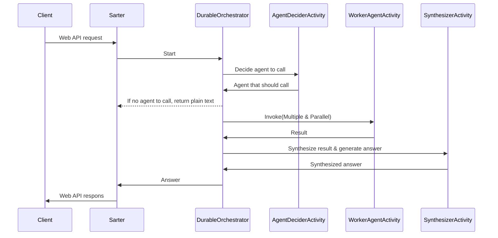

[日本語版はこちら](README_ja.md)

# DurableFunctions template - Orchestrator-workers Multi-Agent 

This repository is a template project for implementing the Orchestrator-Workers pattern introduced in Anthropic's blog "[Building effective agents](https://www.anthropic.com/research/building-effective-agents)" using Azure Durable Functions.


ref: [Anthropic-Building effective agents](https://www.anthropic.com/research/building-effective-agents)

## Sequence Diagram
Case of synchronous endpoint:



## Agent sample
This Multi-Agent system is based on a travel concierge scenario.
Each Agent is set to return fixed values as responses for sample purposes.
The sample Agents defined in the template are as follows:
- GetDestinationSuggestAgent：Get the destination suggestion
- GetClimateAgent：Get the climate of the destination
- GetSightseeingSpotAgent：Get the sightseeing spot of the destination
- GetHotelAgent：Get the hotel information of the destination
- SubmitReservationAgent：Submit the reservation of the hotel

Please modify the implementation of each agent, which currently uses fixed values, to include RAG, actions, and other processes, thereby creating agents that meet the requirements.
Each agent can utilize OpenAI Client and application configuration values provided by the DI container.

To demonstrate the retry functionality of Durable Functions, each Agent includes code that emulates failures in external service calls, such as those to an LLM.
Agent Activities fail randomly with a 30% probability during execution.
When implementing an actual Agent based on the sample Agent, please remove the following parts from the code.
```cs
if(Random.Shared.Next(0, 10) < 3)
{
	logger.LogInformation("Failed to get climate information");
	throw new InvalidOperationException("Failed to get climate information");
}
```

## How to run

1. Update `localsettings.json` at `DurableMultiAgentTemplate` project with your AOAI resource and deployment model name.
2. Run the project.

## Client to test (.NET)

You can check the operation on a simple chat app in .NET as follows:

https://github.com/user-attachments/assets/10425f9a-cd55-4f02-8cd1-6a1935df4db0

### Visual Studio 2022

1. Open the solution file `DurableMultiAgentTemplate.sln` in Visual Studio 2022.
2. Select `Multi agent test` from the startup project.
   - In this step, both the Durable Functions and .NET client projects will be executed simultaneously.
3. Press `F5` to run the projects.
   - If you encounter an error, please check the `localsettings.json` file in the `DurableMultiAgentTemplate` project.

### Visual Studio Code

You can run it with the following command:

```bash
dotnet run --project .\DurableMultiAgentTemplate\DurableMultiAgentTemplate.csproj
dotnet run --project .\DurableMultiAgentTemplate.Client\DurableMultiAgentTemplate.Client.csproj
```

After running the project, you can access the client at `http://localhost:{your port number}`.

## Client to test (Python client)
You can use [client.py](client.py) to test the Orchestrator-Workers pattern.
This client made with Streamlit. So you can run it with the following command at the Client folder:
```bash
streamlit run client.py
```


[The full-resolution video is here.](https://youtu.be/SACD4IyKQAI)

## API
### Endpoints
There are two types of endpoints: synchronous and asynchronous. If the agent's processing takes a long time, it is recommended to use the asynchronous endpoint.
For more information about the asynchronous pattern in Durable Functions, [see here](https://learn.microsoft.com/en-us/azure/azure-functions/durable/durable-functions-overview?tabs=in-process%2Cnodejs-v3%2Cv1-model&pivots=csharp#async-http).

- synchronous`http://{your base url}/api/invoke/sync`
- asynchronous`http://{your base url}/api/invoke/async`

### API　request
The request body will be below:
```json
{
	"messages": [
		{
			"role": "user",
			"content": "I'm finding a travel destination."
		},
		{
			"role": "assistant",
			"content": "Please tell me your desired conditions for the travel destination. For example, a place with a beach, a place with many historical tourist spots, a place with abundant nature, etc. I will suggest a travel destination according to your preferences."
		},
		{
			"role": "user",
			"content": "I like a place with many historical tourist spots."
		}
	],
	"requireAdditionalInfo": true
}
```

### Response
The response will be below:
```json
{
	"additionalInfo": [
		{
			"$type": "mardown",
			"markdownText": "### Recommended Travel Destinations with Historical Landmarks\n#### Domestic\n1. **Okinawa Main Island**\n  - Rich in tourist attractions such as crystal-clear beaches, Shurijo Castle, and the Churaumi Aquarium. \n- Warm weather even in winter, offering a relaxed atmosphere.\n2. **Ishigaki Island and Miyako Island**\n - Expansive beautiful natural landscapes typical of the tropics, with popular activities like diving and snorkeling.\n- Enjoy unique local cuisine of the islands.\n3. **Kagoshima and Amami Oshima**\n - Experience Amami's black sugar shochu, island songs, and distinctive natural environments.\n- Enjoy the subtropical atmosphere."
		}
	],
	"content": "Here are some recommended travel destinations with many historical landmarks:\n1. **Okinawa Main Island** - Features spots that blend history and tourism, such as Shurijo Castle and the Churaumi Aquarium.\n2. **Kagoshima and Amami Oshima** - Enjoy island songs and the subtropical atmosphere.\n3. **Ishigaki Island and Miyako Island** - Known for unique local cuisine and natural landscapes.\nFor more details, please refer to the additional information.",
	"calledAgentNames": [
		"GetDestinationSuggestAgent"
	]
}
```

## Request for additional information
In general, responses from agents, especially when they include retrieval-augmented generation (RAG), can become lengthy and negatively affect the chat experience. To improve this, separating static additional information from the flow of the chat can enhance the user experience.

In this template, you can request additional information by setting `requireAdditionalInfo` to `true` when making a request. The additional information will be returned separately from the chat response and stored in the `additionalInfo` field.

By toggling the `REQUIRE_ADDITIONAL_INFO` flag in the client code for testing, you can experience this functionality in action. 


This feature also reduces the token count of the `messages` array in the chat history, making the LLM's performance lighter. However, in some cases, the lack of context in the `messages` array might result in unnatural agent responses. In such cases, you may consider merging the additional information back into the `messages` array and requesting the agent's response accordingly.