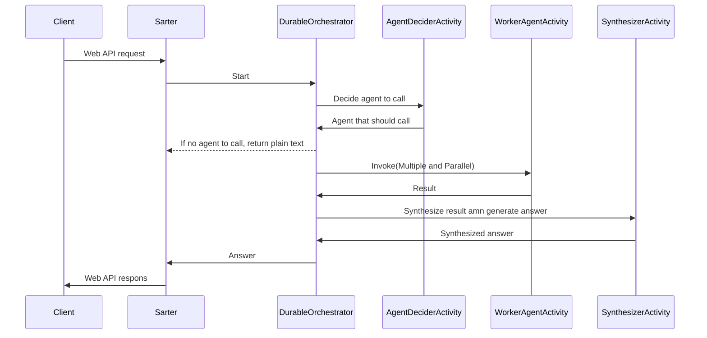

[English version](README.md)

# DurableFunctions template - Orchestrator-workers Multi-Agent 

このリポジトリは、Azure Durable Functionsを使用して、Anthropicのブログ「[Building effective agents](https://www.anthropic.com/research/building-effective-agents)」で紹介されたオーケストレーター-ワーカーのパターンを実装するためのテンプレートプロジェクトです。


ref: [Anthropic-Building effective agents](https://www.anthropic.com/research/building-effective-agents)

## シーケンス図
同期エンドポイントの場合h



## Agent サンプル
このマルチエージェントシステムは、旅行コンシェルジュのシナリオに基づいています。  
各エージェントは、サンプル用に固定値を応答として返すように設定されています。  
テンプレートで定義されているサンプルエージェントは以下の通りです：  
- GetDestinationSuggestAgent：目的地の提案を取得  
- GetClimateAgent：目的地の気候を取得  
- GetSightseeingSpotAgent：目的地の観光地を取得  
- GetHotelAgent：目的地のホテル情報を取得  
- SubmitReservationAgent：ホテルの予約を送信  

## エンドポイント
Starter関数のエンドポイントには同期と非同期の2種類があります。エージェントの処理に時間がかかる場合は、非同期エンドポイントを使用することをお勧めします。Durable Functionsの非同期パターンの詳細については[こちら](https://learn.microsoft.com/ja-jp/azure/azure-functions/durable/durable-functions-overview?tabs=in-process%2Cnodejs-v3%2Cv1-model&pivots=csharp#async-http)。

## テストのためのクライアント
[client.py](client.py) を使用して、Orchestrator-Workers パターンをテストできます。  
このクライアントは Streamlit で作成されていますので、次のコマンドで実行できます：
```bash
streamlit run client.py
```