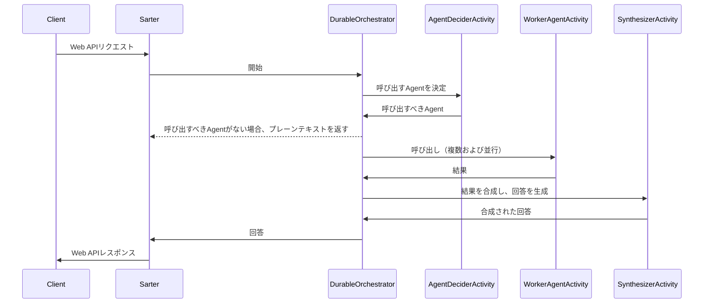

[English version](README.md)

# DurableFunctions template - Orchestrator-workers Multi-Agent 

このリポジトリは、Azure Durable Functionsを使用して、Anthropicのブログ「[Building effective agents](https://www.anthropic.com/research/building-effective-agents)」で紹介されたオーケストレーター-ワーカーのパターンを実装するためのテンプレートプロジェクトです。


ref: [Anthropic-Building effective agents](https://www.anthropic.com/research/building-effective-agents)

## シーケンス図
同期エンドポイントの場合:



## Agent サンプル
このマルチエージェントシステムは、旅行コンシェルジュのシナリオに基づいています。  
各エージェントは、サンプル用に固定値を応答として返すように設定されています。  
テンプレートで定義されているサンプルエージェントは以下の通りです：  
- GetDestinationSuggestAgent：目的地の提案を取得  
- GetClimateAgent：目的地の気候を取得  
- GetSightseeingSpotAgent：目的地の観光地を取得  
- GetHotelAgent：目的地のホテル情報を取得  
- SubmitReservationAgent：ホテルの予約を送信  

固定値になっている各Agentの実装をを改変してRAGやAction、その他処理を実装することで要件にあったAgentを作成してください。
各AgentではDIコンテナからOpenAI ClientやCosmos DB Client、アプリケーション構成値などが利用可能です。

Durable Functionsのリトライ機能を実証するために、各AgentにはLLMなどの外部サービス呼び出しの失敗をエミュレートするコードが記述されています。
Agent Activityはランダムに30%の確率で実行が失敗します。
実際にAgentを実装する際にサンプルAgentをベースにする場合はコードから以下の部分を削除してください。
```cs
if(Random.Shared.Next(0, 10) < 3)
{
	logger.LogInformation("Failed to get climate information");
	throw new InvalidOperationException("Failed to get climate information");
}
```

## ローカルセットアップ方法
0. 事前に以下のリソースを作成してください。
	- Azure OpenAI Serviceとチャット補完モデルのデプロイ（埋め込みモデルのデプロイは任意）
	- Azure Cosmos DB（使用しない場合は省略可能）
       - Azure Cosmos DBの代わりに、Azure Cosmos DB Emulator（エミュレーター）を使用することもできます。詳細については、以下のドキュメントをご参照ください。  
       [Azure Cosmos DB エミュレーターを使用したローカルでの開発](https://learn.microsoft.com/ja-jp/azure/cosmos-db/how-to-develop-emulator?tabs=windows%2Ccsharp&pivots=api-nosql)

1. `DurableMultiAgentTemplate` プロジェクトの `local.settings.json` を更新し、ご自身の以下のリソースの情報を設定します。
	- Azure OpenAIのエンドポイントとデプロイ名
	- Azure Cosmos DBのエンドポイント（使用しない場合は省略可能）

	各サービスへの認証はAPIキーまたはEntra ID認証を選択できます。
	- APIキーを使用する場合：`local.settings.json` ファイルにAPIキーを記述してください。
	- Entra ID認証を使用する場合：Azure CLIを使用して`az login`コマンドで認証してください。`local.settings.json` ファイルAPIキーは空白にしてください。この際に、**認証したユーザーに各サービスのRBACが付与されている必要があることに注意してください。**

2. プロジェクトを実行します。

## ローカル実行方法
プロジェクトのテストには .NET Blazor クライアントまたは Python streamlit クライアントのどちらかを使用できます。

### .NETクライアント

.NET のシンプルなチャットアプリを使用して動作をテストできます：

https://github.com/user-attachments/assets/10425f9a-cd55-4f02-8cd1-6a1935df4db0

#### Visual Studio 2022 での実行

1. Visual Studio 2022 でソリューションファイル `DurableMultiAgentTemplate.sln` を開きます。
2. スタートアッププロジェクトとして `Multi agent test` を選択します。
   - これにより、Durable Functions プロジェクトと .NET クライアントプロジェクトの両方が同時に実行されます。
3. `F5` を押してプロジェクトを実行します。
   - エラーが発生した場合は、`DurableMultiAgentTemplate` プロジェクトの `local.settings.json` ファイルを確認してください。

#### Visual Studio Code での実行

1. Visual Studio Code のアクティビティバーから `実行とデバッグ` を選択します。
2. ドロップダウンリストから、`C#: DurableMultiAgentTemplate Debug` を選択し、ドロップダウンリスト左の実行ボタンを押します。
3. ドロップダウンリストから、`C#: DurableMultiAgentTemplate.Client Debug` を選択し、ドロップダウンリスト左の実行ボタンを押します。

プロジェクトを実行した後、`http://localhost:{your port number}` でクライアントにアクセスできます。

### Pythonクライアント
[client.py](Client/client.py) を使用して、Orchestrator-Workers パターンをテストできます。
次のコマンドで実行できます：
```bash
dotnet run --project .\DurableMultiAgentTemplate\DurableMultiAgentTemplate.csproj
```

クライアントは Streamlit で作成されているため、次のコマンドで実行できます：
```bash
streamlit run client.py
```


[The full-resolution video is here.](https://youtu.be/SACD4IyKQAI)

## テンプレートでホストされるAPI仕様
### エンドポイント
Starter関数のエンドポイントには同期と非同期の2種類があります。エージェントの処理に時間がかかる場合は、非同期エンドポイントを使用することをお勧めします。
Durable Functionsの非同期パターンの詳細については[こちら](https://learn.microsoft.com/ja-jp/azure/azure-functions/durable/durable-functions-overview?tabs=in-process%2Cnodejs-v3%2Cv1-model&pivots=csharp#async-http)。

- 同期エンドポイント：`http://{your base url}/api/invoke/sync`
- 非同期エンドポイント：`http://{your base url}/api/invoke/async`

### リクエストボディ
リクエストボディは、次のようになります。
```json
{
	"messages": [
		{
			"role": "user",
			"content": "おすすめの旅行先を見つけて欲しい"
		},
		{
			"role": "assistant",
			"content": "旅行先についての希望の条件を教えてください。例えば、ビーチがある場所、歴史的な観光地が多い場所、自然が豊かな場所など、ご希望に応じておすすめの旅行先を提案します。"
		},
		{
			"role": "user",
			"content": "歴史的な観光地が多い場所かな〜"
		}
	],
	"requireAdditionalInfo": true
}
```

### レスポンス
レスポンスは次のようになります。
```json
{
	"additionalInfo": [
		{
			"$type": "mardown",
			"markdownText": "### おすすめの歴史的観光地が多い旅行先\n\n#### 国内\n1. **沖縄本島**  \n   - 透明度の高いビーチ、首里城、美ら海水族館など観光名所が豊富。  \n   - 冬でも暖かく、リラックスした雰囲気を楽しめる。\n\n2. **石垣島・宮古島**  \n   - 南国らしい美しい自然が広がり、ダイビングやシュノーケリングが人気。  \n   - 島ならではの郷土料理も楽しめる。\n\n3. **鹿児島・奄美大島**  \n   - 奄美の黒糖焼酎や島唄、特有の自然環境を満喫。  \n   - 亜熱帯の雰囲気を楽しめる。"
		}
	],
	"content": "歴史的な観光地が多い場所としては以下の旅行先がおすすめです。\n\n1. **沖縄本島** - 首里城をはじめ、美ら海水族館など歴史と観光が融合したスポットがあります。\n2. **鹿児島・奄美大島** - 島唄や亜熱帯の雰囲気が楽しめます。\n3. **石垣島・宮古島** - 島独特の郷土料理と自然景観が魅力です。\n\n詳しくは補足情報を参照してください。",
	"calledAgentNames": [
		"GetDestinationSuggestAgent"
	]
}
```


[フル解像度の動画はこちら](https://youtu.be/SACD4IyKQAI)

## 補足情報の要求
一般にエージェントからの返答(特にRAGを含む場合)は文章量が長くなり、チャット体験を阻害する要因になることがあります。
そのため、ストック型の補足情報とフロー型のチャットを分離し、チャット体験を向上できます。
このテンプレートではリクエストの際に`requireAdditionalInfo`を`true`に設定すると、補足情報を要求することができます。
補足情報はレスポンスの`additionalInfo`に格納されチャットの返答とは別に返されます。
テストのためのクライアントコード内の`REQUIRE_ADDITIONAL_INFO`フラグを切り替えることでこの機能を体験できます。


この機能は副次的にチャット履歴のmessages配列のトークン量を削減し、LLMの動作を軽快にする効果もあります。
ただし、シナリオによってはmessages配列のコンテキストが欠落し、エージェントの返答が不自然になることがあります。
そのような場合には必要に応じて補足情報の内容をmessagesにマージしてエージェントにリクエストすることも検討してください。

## Azure環境のセットアップ
TBW
https://learn.microsoft.com/ja-jp/azure/azure-functions/durable/durable-functions-isolated-create-first-csharp?pivots=code-editor-vscode#sign-in-to-azure
